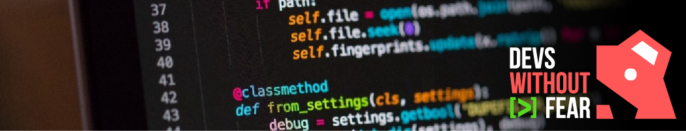

# **🐍 Python Sin Miedo**

## **📘 Descripción**
No solo aprenderemos la sintaxis de Python, iremos un poco más lejos, comprender el entorno es clave para que nada en este mundo se nos resista, siendo este nuestro punto de partida y poniéndonos como meta un proyecto final para integrar nuestras nuevas habilidades.

Al final del curso, tendrás la capacidad de aprender sobre nuevas aplicaciones de Python por tu cuenta, explorar librerías e incluso construir las propias.

---

## **📋 Contenidos**
 

	
<strong><a href="Sesion 1/Introduction.md">Preparación del Entorno</a></strong>

*	Entorno del Sistema
*	¿Qué es el terminal? y ¿cómo se come?
*	Preparación y configuración del terminal
*	Navegando a través del terminal 
*	Bonus: WSL
*	Editor de texto

	
<strong><a href="Sesion 2/Interludio.md">Python - Interludio</a></strong>

*	Instalación
*	Entorno y ejecución
*	Entornos virtuales
*	Instalación de paquetes
*	Introducción a algoritmos y scripting

	
<strong><a href="Sesion 2/Verso.md">Python - Verso</a></strong>

*	Variables
*	Tipos de datos
*	Operadores lógicos
*	Estructuras de control de flujo

	+	Condicionales
	+	Ciclos

*	Funciones
*	Strings (cadena de caracteres)
*	Colecciones

	+	Tuplas
	+	Listas
	+	Diccionarios
	+	Conjuntos

	
<strong>Python - Estribillo</strong>

*	Métodos de compresión de listas y diccionarios
*	Funciones anónimas
*	Funciones de orden superior
*	Errores
*	Debugging
*	Control de Errores
*	Assert statements
*	Manipulación de archivos

---

<footer>

 This work is licensed under a  <a rel="license" href="http://creativecommons.org/licenses/by-sa/4.0/">Creative Commons Attribution-ShareAlike 4.0 International License</a>
 © Ing. Christian Dávila, 2021
 davila.met.92@gmail.com

</footer>